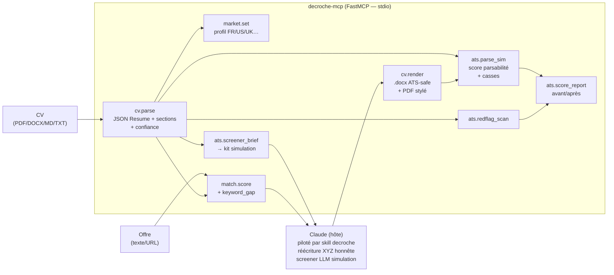

<div align="center">

# decroche-mcp

**MCP 360° pour décrocher un emploi — bat l'ATS et le screener LLM honnêtement (Phase 1 : cœur anti-rejet CV).**

[](https://github.com/Casius999/decroche-mcp/actions/workflows/ci.yml)
[](https://scorecard.dev/viewer/?uri=github.com/Casius999/decroche-mcp)
[](https://github.com/Casius999/decroche-mcp/releases)
[](./LICENSE)

</div>

## Table of Contents

- [Overview](#overview)
- [Architecture](#architecture)
- [Install](#install)
- [MCP Client Config](#mcp-client-config)
- [Features — Phase 1](#features--phase-1)
- [Development](#development)
- [Contributing](#contributing)
- [Security](#security)
- [License](#license)

## Overview

`decroche-mcp` is a deterministic Python/FastMCP MCP server for the complete 360° job-landing
pipeline. It exposes **pure, testable, zero-LLM tools** — the host Claude (guided by the
`decroche` skill) does all the reasoning and rewriting.

**Phase 1 (this release):** CV anti-rejection core — parse a CV (PDF/DOCX/MD/TXT) into a validated
JSON Resume, detect sections, score parse confidence, and expose FR/US market profiles. No magic,
no hallucinated metrics, no hidden-text tricks.

**Honesty guarantees (hard-coded):**
- `keyword_gap` marks each gap as `addable_honestly` (real skill, not yet phrased) or
  `genuinely_missing` — never invents credentials.
- `cv.xyz_scaffold` signals missing metrics (`y_present: false`) and asks for real numbers.
- `ats.redflag_scan` *detects* prompt-injection / hidden-text tactics and reports them; never
  produces them.

## Architecture



## Install

```bash
# Run as MCP server via uvx (recommended — no install needed):
uvx decroche-mcp

# Or install in a project:
uv add decroche-mcp

# From source:
git clone https://github.com/Casius999/decroche-mcp.git
cd decroche-mcp
uv venv && uv sync --extra dev
```

## MCP Client Config

Add to your Claude Desktop / MCP client config:

```json
{
  "mcpServers": {
    "decroche-mcp": {
      "command": "uvx",
      "args": ["decroche-mcp"]
    }
  }
}
```

## Features — Phase 1

| Tool | Description |
|------|-------------|
| `cv_parse` | Parse PDF/DOCX/MD/TXT → JSON Resume + sections + confidence score + warnings |
| `market_get` | Get active market profile (FR by default) |
| `market_set` | Set active market profile (`fr`, `us`, `uk`, `ca-en`, `ca-fr`) |
| `market_available` | List available market profile ids |

Phase 2+ tools (ATS simulation, match scoring, XYZ scaffold, render, apply queue) come in
subsequent tranches. See [CHANGELOG.md](./CHANGELOG.md).

## Development

```bash
uv venv
uv sync --extra dev

# Lint
uv run ruff check .
uv run ruff format --check .

# Tests with coverage
uv run pytest --cov --cov-report=term-missing --cov-fail-under=80

# Run the server (stdio — attach an MCP client)
uv run decroche-mcp
```

## Contributing

Contributions are welcome! Please read [CONTRIBUTING.md](./CONTRIBUTING.md) and our
[Code of Conduct](./CODE_OF_CONDUCT.md). Commits follow
[Conventional Commits](https://www.conventionalcommits.org/) and must be signed.

## Security

Found a vulnerability? Please follow our [Security Policy](./SECURITY.md) and report privately —
do **not** open a public issue.

## License

Licensed under the [MIT](./LICENSE) license. © 2026 Julien Compain.
